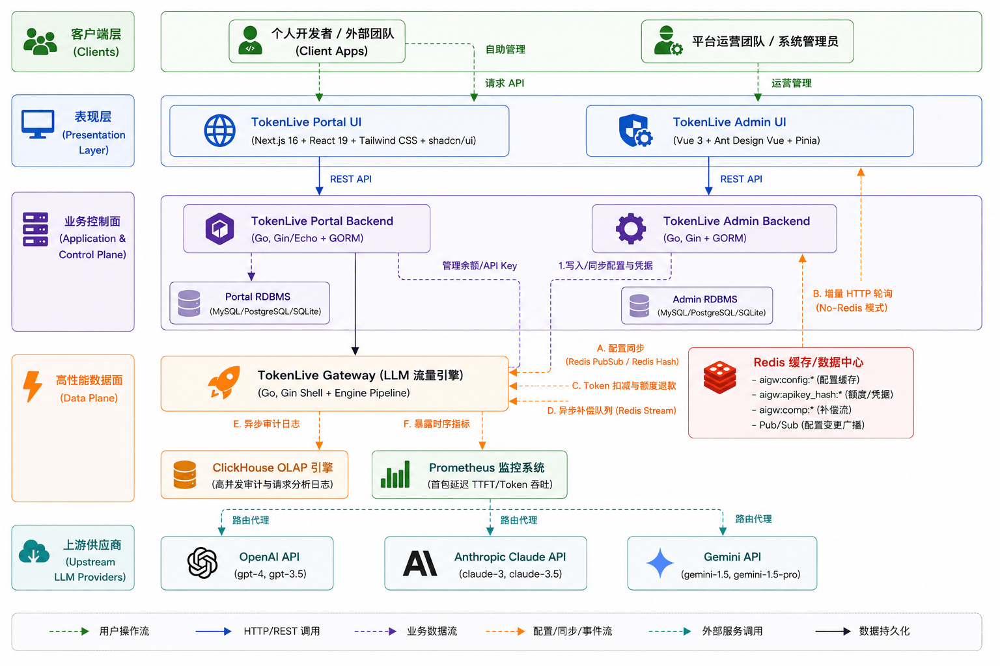

## Hi there 👋

> 📖 **"In the veins of code, let governance endure and life evergreen." — Commemorating the origin and spirit of TokenLive.**

---

## 🌟 Our Mission

In the cloud-native era where microservices and large language models intertwine, the gateway is the throat of all traffic — the "lifeline" that determines the survival of AI applications. **TokenLive** is not a cold traffic forwarder. Its core design and governance philosophy are a direct inheritance from `joylive-agent`, our open-source project built on years of deep expertise. We carry forward JoyLive's powerful multi-active, full-chain scheduling, and lossless governance capabilities, dedicated to providing resilient self-healing and high-availability foundations for high-concurrency Token floods under complex heterogeneous LLM routing.

---

## 🧱 Architecture & Design

TokenLive deeply embraces the Go engineering aesthetics of **"high cohesion, low coupling, high performance"**, adopting an original **Gin Shell + Engine Pipeline** — a "shell + core" layered architecture.

### 🛠️ Technical Highlights

1. **Gin Shell + Engine Pipeline Skeleton**: Decouples the shell (routing, CORS, AuthN) from the gateway core (routing retry, model circuit breaking, streaming billing). The core is built entirely on native Go `net/http` and can be embedded as a zero-dependency SDK into any Go microservice.
2. **High Concurrency & Object Pooling**: The core context `GatewayContext`, used throughout the request lifecycle, employs `sync.Pool` for object reuse — eliminating frequent GC under high concurrency and achieving ultra-low latency jitter.
3. **Dual-Tier Local Cache**: API Key authorization and governance policies use a **30s positive LRU cache + 10s negative cache (anti-penetration)**, dramatically reducing Redis load and delivering microsecond-level validation even under thousand-level concurrency.
4. **Reliable Compensation Queue**: For critical writes such as session stickiness and Token settlement, if Redis experiences transient failures, the gateway automatically pushes tasks into a **Compensation Queue** driven by Redis Stream. A background consumer group performs exponential backoff retries, ensuring eventual consistency of financial and session data.

---

## 💎 Product Features

The TokenLive platform is a synergy of two sub-projects: **TokenLive Gateway (Core Engine)** and **TokenLive Admin (Management Console)**.

### 🛡️ TokenLive Gateway: Rock-Solid Compute Governance Engine

| Dimension | Feature | Business Value |
| :--- | :--- | :--- |
| **Multi-Protocol Compatibility & Extensibility** | Fully compatible with OpenAI standard protocol (Chat, Embeddings, Models); native integration with OpenAI, Anthropic, and other vendors; supports capability-oriented design and Endpoint-level UpstreamModel rewriting. | Drop-in integration — switch LLM providers without modifying business code, avoiding vendor lock-in. |
| **High-Availability Traffic Governance** | Original Endpoint (single endpoint) and Provider (vendor model) **dual-layer circuit breaker isolation**; supports Capability/Tag/CircuitBreaker dynamic routing filter chains. | Instantly isolates faulty endpoints or vendor models, ensuring system self-healing and high availability under high concurrency. |
| **8 Advanced Load Balancing Algorithms** | Built-in RoundRobin, Weighted, Random, LeastConnections, LeastLatency, Cost, Sticky (Prompt Cache affinity), and more — 8 algorithms total. | Maximizes utilization of upstream node TTFT and Prompt Cache, reducing model response latency. |
| **High-Precision Streaming Settlement** | Uses `SSEInterceptWriter` to transparently wrap streaming output, incrementally parsing TTFT (Time To First Token) and actual Token consumption. Provides **"pre-deduction with differential refund settlement."** | Perfectly handles mid-stream retries, cascading fallbacks, and stream interruptions — preventing Token under-billing or over-billing. |
| **Lock-Free Hot Configuration Updates** | Policy and mechanism decoupling — uses `atomic.Pointer` for whole-object atomic replacement of the in-memory PolicyMatcher. Policies take effect instantly. | Hot-reload policy changes without restarting the gateway — zero jitter under high-concurrency requests. |

### 📊 TokenLive Admin: Fine-Grained, Multi-Dimensional Control Panel

1. **Infrastructure Resource Management**:
   - **Provider Management**: Unified management of OpenAI, Anthropic, Azure, DeepSeek, Qwen, self-hosted Ollama, and other LLM access points.
   - **Model & Alias Mapping**: Supports model alias mapping, multi-endpoint weight and priority association, and Endpoint-level fine-grained upstream model name rewriting.
2. **Visual Traffic Governance Policies**:
   - Supports visual configuration of **routing policies**, **rate limiting**, **circuit breaking**, **fault injection**, **load balancing selection**, **access whitelists**, and more.
   - Supports four-level priority policy override algorithm: `User+Model` > `Model+*` > `*+User` > `Global fallback`, enabling extremely fine-grained policy differentiation.
3. **Multi-Space (Multi-Tenant) Isolation**:
   - Provides multi-workspace (tenant-level) resource isolation to organize providers, models, and policies by department or team.
4. **Fine-Grained RBAC & Audit**:
   - High-performance console built on **Vue 3 + Vite + Ant Design Vue**.
   - Fine-grained permission control using **GORM + Casbin**, with built-in API Key lifecycle management and operation audit logs — every governance change is traceable.

---

## 🚀 Future Vision

TokenLive carries the accumulated experience of microservice governance and innovative design for the LLM era. In our future roadmap, we will continue to advance the following directions:

- [ ] **Broader Provider Integration**: Deep integration with Google Gemini, DeepSeek-V3/R1, Alibaba Qwen, Kimi, and other top domestic and international models.
- [ ] **Cloud-Native Service Discovery**: Full Kubernetes Discovery support for dynamic service discovery — automatic onboarding/offboarding of cloud-native LLM nodes.
- [ ] **Enterprise Multi-Tenant Dashboards**: Detailed multi-dimensional analytics for multi-team API Keys (Token consumption trends, TTFT monitoring, error rate analysis, provider cost accounting, etc.).
- [ ] **LLM Application Gateway Components**: Exploring advanced AI Gateway features such as security compliance interception (Prompt sensitive word filtering), RAG retrieval-augmented caching, and Agent state coordination.

**"Open source never dies; code stays evergreen."**

No matter how rapidly technology evolves, TokenLive will hold fast to its mission — to be the most solid and enduring compute governance foundation for enterprises in the flourishing LLM ecosystem.
